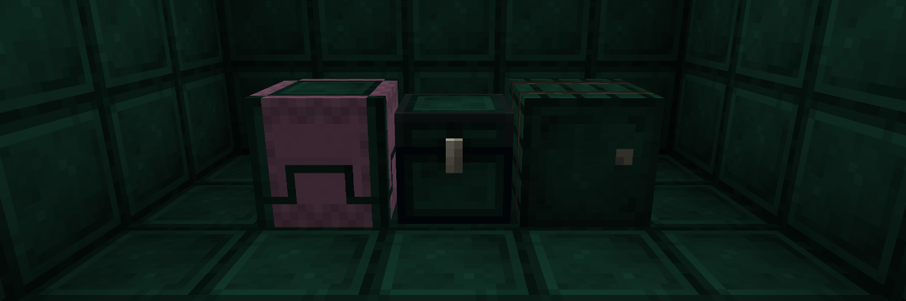

# Enderite Reinforced Storage

The Enderite Reinforced Storage mod adds enderite reinforced storage.

This depends on:

- **Enderite Mod (for Fabric)**
  - CurseForge: <https://www.curseforge.com/minecraft/mc-mods/enderite-mod-for-fabric>
  - GitHub: <https://github.com/Nic4Las/Minecraft-Enderite-Mod>
- At least one of the reinforced storage mods
  - **Reinforced Chests** (_Version 2.0.0 and above_)
    - CurseForge: <https://www.curseforge.com/minecraft/mc-mods/reinforced-chests>
    - GitHub: <https://github.com/Aton-Kish/reinforced-chests>
  - **Reinforced Shulker Boxes** (_Version 2.0.0 and above_)
    - CurseForge: <https://www.curseforge.com/minecraft/mc-mods/reinforced-shulker-boxes>
    - GitHub: <https://github.com/Aton-Kish/reinforced-shulker-boxes>
  - **Reinforced Barrels** (_Version 2.0.0 and above_)
    - CurseForge: <https://www.curseforge.com/minecraft/mc-mods/reinforced-barrels>
    - GitHub: <https://github.com/Aton-Kish/reinforced-barrels>

## Recipe

| Name                 | Type            | Ingredients                            | Recipe                                                                                                                    | Description                                                                                                                                                                                       |
| -------------------- | --------------- | -------------------------------------- | ------------------------------------------------------------------------------------------------------------------------- | ------------------------------------------------------------------------------------------------------------------------------------------------------------------------------------------------- |
| Enderite Chest       | Smithing        | Netherite Chest + Enderite Ingot       |                         | A enderite chest has 108 slots of inventory space, and a large enderite chest has twice that amount, at 216 slots. This is resistant to blast, fire and lava. When you drop it, it floats on air. |
| Enderite Shulker Box | Smithing        | Netherite Shulker Box + Enderite Ingot |             | A enderite shulker box has 108 inventory slots. This is resistant to blast, fire and lava. When you drop it, it floats on air.                                                                    |
|                      | Shaped Crafting | Enderite Chest + Shulker Shell         |  | _Only available if both the Reinforced Chests mod and the Reinforced Shulker Boxes mod have been loaded._                                                                                         |
| Enderite Barrel      | Smithing        | Netherite Barrel + Enderite Ingot      |                       | A enderite barrel has a container inventory with 108 slots. This is resistant to blast, fire and lava. When you drop it, it floats on air.                                                        |

### Dyeing

| Name                     | Ingredients                             |
| ------------------------ | --------------------------------------- |
| Any Enderite Shulker Box | Any Enderite Shulker Box + Matching Dye |

Dyed enderite shulker boxes can be undyed using a cauldron.

## License

The Enderite Reinforced Storage mod is licensed under the MIT License, see [LICENSE](./LICENSE).
